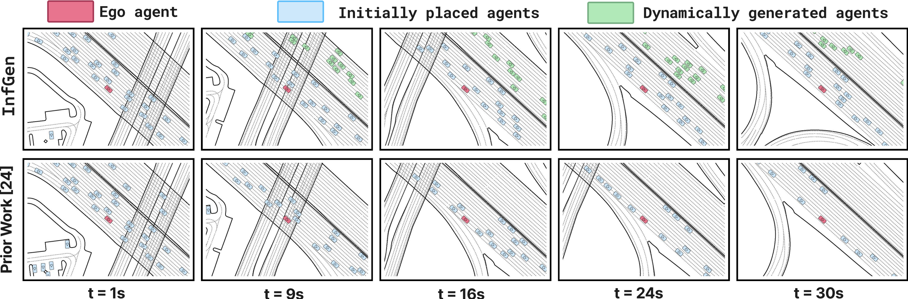

# Long-term Traffic Simulation with Interleaved Autoregressive Motion and Scenario Generation

TL;DR InfGen performs interleaved *long-term* closed-loop motion simulation and scene generation with *unified next-token prediction*.



> [**Long-term Traffic Simulation with Interleaved Autoregressive Motion and Scenario Generation**](https://orangesodahub.github.io/InfGen/)                
> Xiuyu Yang*, Shuhan Tan*, Philipp Krähenbühl (* equal contribution)                                  
> *ICCV 2025 ([arXiv 2506.17213](https://arxiv.org/abs/2506.17213))*

## BibTeX
If you find our work useful in your research, please consider citing our paper:
```bibtex
@inproceedings{yang2025infgen,
    title={Long-term Traffic Simulation with Interleaved Autoregressive Motion and Scenario Generation},
    author={Yang, Xiuyu and Tan, Shuhan and Kr{\"a}henb{\"u}hl, Philipp},
    booktitle={Proceedings of the IEEE/CVF International Conference on Computer Vision (ICCV)},
    year={2025}
}
```

## Environment Setup

Run the following script, and create new environemnt with name infgen (default)

```bash
git --recurse-submodules clone https://github.com/OrangeSodahub/InfGen.git
cd InfGen/

conda env create -f environment.yaml [-n ENV_NAME]
conda activate infgen
```

> Alternatively, you can refer to [SMART#requirements](https://github.com/rainmaker22/SMART?tab=readme-ov-file#requirements) for manually installations.

## Data Preparation

> NOTE: We have similar execution steps to SMART, but the outputs of Step3 are not identical.

**Step 1: Download the Dataset**

Download the Waymo Open Motion Dataset (`scenario protocol` format) from [here](https://waymo.com/open/download/). The version of WOMD used in InfGen is `v1.2.1`.


**Step 2: Install the Waymo Open Dataset API**

Follow the instructions [here](https://github.com/waymo-research/waymo-open-dataset) to install the Waymo Open Dataset API.

**Step 3: Preprocess the Dataset**

Preprocess the dataset by running: where `$SPLIT` is chosen from "training" and "validation".
```bash
bash scripts/data_preprocess.sh $SPLIT [--input_dir] [--output_dir]
```
The first path is the raw data path, and the second is the output data path.

The processed data will be saved to the `data/waymo_processed/` directory as follows:

```
InfGen
├── data
│   ├── waymo_processed
│   │   ├── training
│   │   ├── validation
│   │   ├──testing
├── model
├── utils
```

## Train

Run the following script: where set the number of processes in DDP by `$GPUS`

```bash
bash scripts/run_train.sh $GPUS
```

## Evaluation

First set the `CKPT_PATH` in the following script and run:

```bash
bash scripts/run_eval.sh $GPUS
```

## TODO

- [x] Release arXiv technical report
- [x] Release full codes
- [ ] Release other detailed instructions


## Acknowledgement

Thansk for these excellent opensource works and models: [SMART](https://github.com/rainmaker22/SMART); [CatK](https://github.com/NVlabs/catk).
